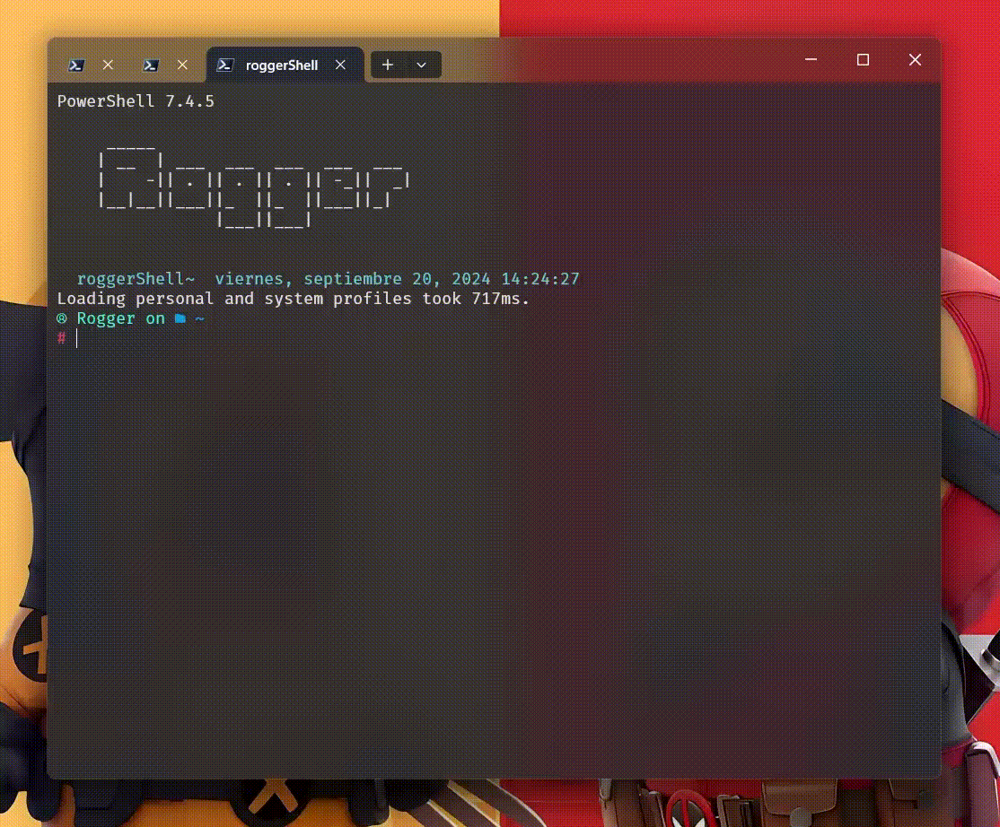

# Proyecto camino mínimo

Dado `𝑛 ∈ [8, 16]` ingresado por el usuario, el programa debe generar aleatoriamente
una matriz simétrica `𝑛 × 𝑛` (con elementos positivos) o solicitar el ingreso de cada
elemento de la matriz (según decisión del usuario). Además, debe mostrar el grafo
etiquetado asociado a esta matriz y el camino mínimo que existe entre dos vértices
seleccionados por el usuario. Todo el proceso, desde la generación de la matriz hasta
el cálculo del camino mínimo, se debe mostrar paso a paso, proporcionando una
visualización clara y detallada del funcionamiento interno del algoritmo

## Instalación y Configuración entorno virtual
 
 > 💡 Comandos básicos: 
 > - cd : moverse entre directorios
 > - pwd : para mostrar del directorio actual
 > - ls : para mostrar los archivos de la carpeta

 1. Dentro de una terminal (powershell) nos dirigiremos hacía la ruta del repositorio clonado

    ~~~PS
     # Creamos el entorno virutal
    py -3 -m venv .mateComputacional
    ~~~

 2. Activamos el entorno virtual con el comando
 
    ~~~PS
    .\.mateComputacional\Scripts\activate
    ~~~
    
 3. Instalamos los requerimientos
    
    ~~~PS
    pip install -r requirements.txt
    ~~~